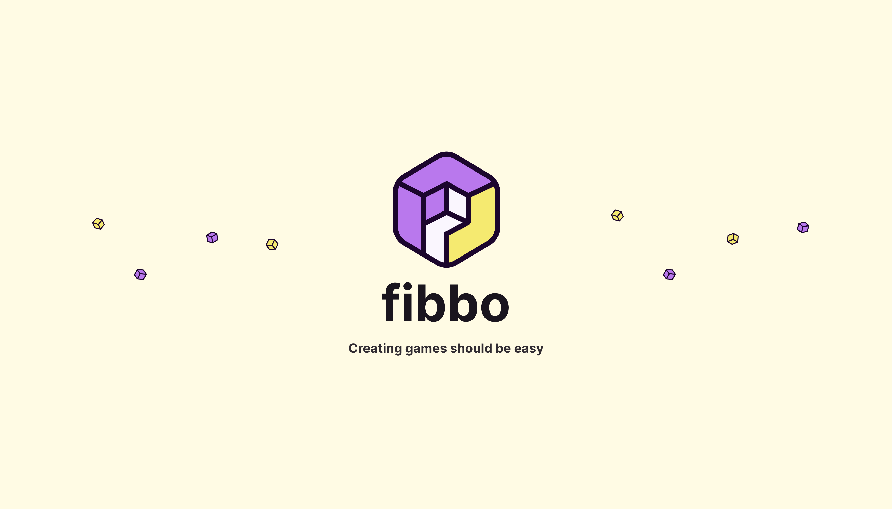

[](https://fibbo.dev/)

# Fibbo

[![npm version][npm-version-src]][npm-version-href]
[![npm downloads][npm-downloads-src]][npm-downloads-href]
[![License][license-src]][license-href]
[![Test][test-src]][test-href]

Fibbo is a free and open-source web-based game engine that allows you to create interactive experiences using JavaScript, right in your browser.

It is designed to be simple to use, extensible, and flexible. You can use it to create games, simulations, visualizations, and more.

Fibbo exposes a simple object-oriented API that allows you to create and manipulate objects in a scene, both in 2D or 3D. You can add objects to the scene, move them around, rotate them, and much more.

- [🏡 Documentation](https://fibbo.dev/)
- [🧪 Test Report](https://fibbo.dev/test-reports)
- [🎮 2D Playground](https://fibbo.dev/playground-2d)
- [🎮 3D Playground](https://fibbo.dev/playground-3d)

## Installation

See the [installation guide](https://fibbo.dev/getting-started/installation) for more information.

## Tech stack

- Game stuff
  - [Three.js](https://threejs.org/) for 3D rendering
  - [Rapier](https://rapier.rs/) for physics
  - [PixiJS](https://pixijs.com/) for 2D rendering
  - [Vue](https://vuejs.org/) for the devtools
- Tooling
  - [Nx](https://nx.dev/) for monorepo management
  - [unbuild](https://github.com/unjs/unbuild) for building the packages
  - [Vite](https://vitejs.dev/) for the playgrounds + building the devtools
  - [VitePress](https://vitepress.dev/) for the documentation
  - [Vitest](https://vitest.dev/) for testing
  - [TypeDoc](https://typedoc.org/) for the API Reference part of the documentation
  - [ESLint](https://eslint.org/) for linting

## Development

- Install dependencies

```bash
npm install
```

- To develop on the 3D package, run the 3D playground :

```bash
npm run dev:3d
# or on Windows :
npm run dev:3d:windows
```

You can now open your browser and navigate to `http://localhost:5173/playground-3d`.

- To develop on the 2D package, run the 2D playground :

```bash
npm run dev:2d
# or on Windows :
npm run dev:2d:windows
```

You can now open your browser and navigate to `http://localhost:5173/playground-2d`.

## Documentation

The documentation is using [VitePress](https://vitepress.dev/).
You can run the documentation locally by running:

```bash
npm run docs:dev
```

Also, the API Reference part is generated using [TypeDoc](https://typedoc.org/). You can generate it by running:

```bash
npm run docs:generate
```

You can now open your browser and navigate to `http://localhost:5173`.

## Contributing

See the [contributing guide](https://fibbo.dev/more/contributing) for more information.

## Credits

3D models and sprites used for development purpose are from [Kenney](https://kenney.nl/assets?q=3d) and [glTF-Sample-Assets](https://github.com/KhronosGroup/glTF-Sample-Assets).

<!-- Badges -->
[npm-version-src]: https://img.shields.io/npm/v/@fibbojs/core/latest.svg?style=flat&colorA=18181B&colorB=28CF8D
[npm-version-href]: https://npmjs.com/package/@fibbojs/core

[npm-downloads-src]: https://img.shields.io/npm/dm/@fibbojs/core.svg?style=flat&colorA=18181B&colorB=28CF8D
[npm-downloads-href]: https://npmjs.com/package/@fibbojs/core

[license-src]: https://img.shields.io/npm/l/@fibbojs/core.svg?style=flat&colorA=18181B&colorB=28CF8D
[license-href]: https://npmjs.com/package/@fibbojs/core

[test-src]: https://img.shields.io/badge/test-report-28CF8D?style=flat&colorA=18181B&colorB=28CF8D
[test-href]: https://fibbo.dev/test-reports
